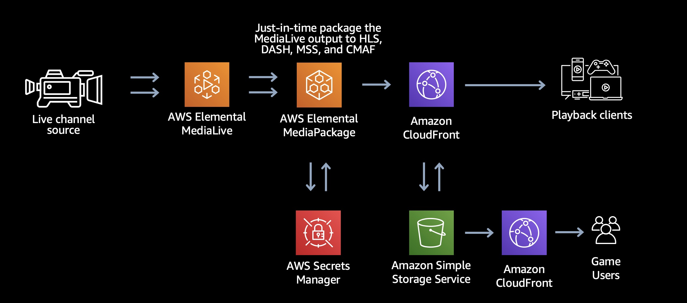

<h2 id="Game1">線上真人百家樂</h2>

*   [線上真人百家樂](#Game1)
    *   [應用說明](#Game11)
    *   [架構目標](#Game12)
    *   [架構特性](#Game13)
    *   [AWS服務](#Game14)
    *   [參考架構](#Game15)
* * *

<h3 id="Game11">應用說明</h3>

線上真人百家樂是透線上直播的方式，以真人發牌方式，透過直播系統將檯面發牌資訊，即時提供遊戲玩家，以杜絕過往電腦全自動發牌或機械手臂發牌所帶來的顧忌，希望可以有更公平公正的遊戲方式。

<h3 id="Game12">架構目標</h3>

- 視訊串流為主，不能有latency 延遲
（規格一般表現在3- 5秒內）
-  需要連接多個視訊源
-   影像辨識牌
-  下注指令和現場行為要足夠流暢

<h3 id="Game13">架構特性</h3>

- 推拉RTMP, HLS, WebRTC低延遲碼流
- 影片編碼的所有基礎設施的佈建和管理都自動化，讓您在最短時間內就能部署一個簡單的視訊頻道
- 您只需為所使用的服務付費，不用前期投資編碼基礎設施
- 可靠性和彈性的項服務可管理跨多個可用區域的資源，也會自動監控其運作狀態，因此可以偵測並解決任何可能發生的問題，而不會中斷即時頻道
- 全球化網路節點與簡化的流量管理
- 加速的網路存取敏感高應用程式構特性

<h3 id="Game14">AWS服務</h3>

- [AWS Elemental MediaLive](https://aws.amazon.com/tw/medialive/)
- [AWS Elemental MediaPackage](https://aws.amazon.com/tw/mediapackage/)
- [Amazon S3](https://aws.amazon.com/tw/s3/)
- [Amazon CloudFront](https://aws.amazon.com/tw/cloudfront/)

<h3 id="Game15">參考架構</h3>

參考架構

* * *

