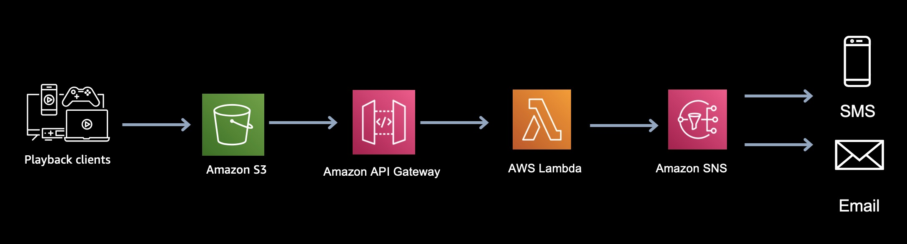

<h2 id="Game1">簡訊驗證機</h2>

*   [應用說明](#Game11)
*   [架構目標](#Game12)
*   [架構特性](#Game13)
*   [AWS服務](#Game14)
*   [參考架構](#Game15)
* * *

<h3 id="Game11">應用說明</h3>

簡訊驗證機

<h3 id="Game12">架構目標</h3>

- 能夠自動產生亂數服務
- 有當地電信商串接
- 簡訊費用成本需要考量

<h3 id="Game13">架構特性</h3>

- 全球一致化的簡訊驗証機制
- 避免需要和當地電信整合, 直接向 200 多個國家/地區的使用者傳送訊息或通知
- 使用單一端點為所有平台 ，包括Apple、Android 和其他平台上使用行動推送或電子郵件 (SMTP) 推送行動通知

<h3 id="Game14">AWS服務</h3>

- [Amazon Simple Notification Service](https://aws.amazon.com/tw/sns/)
- [AWS Lambda](https://aws.amazon.com/tw/lambda/)
- [Amazon DynamoDB](https://aws.amazon.com/tw/dynamodb/)

<h3 id="Game15">參考架構</h3>

參考架構

* * *

