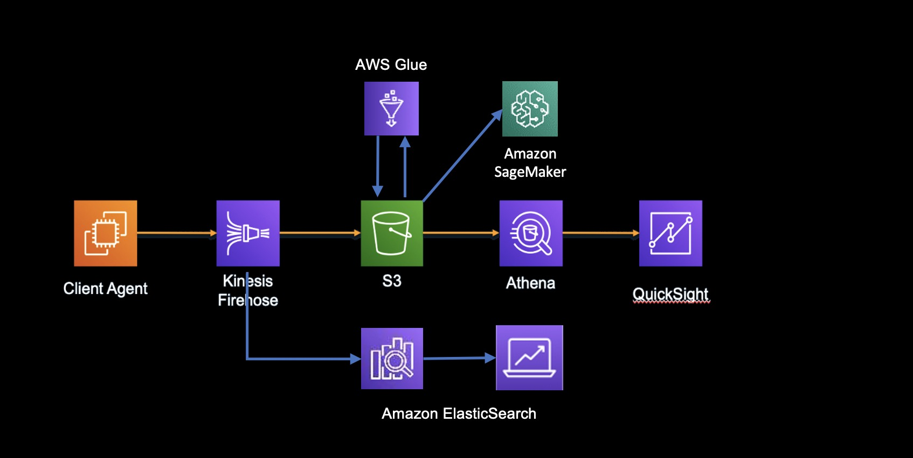

<h2 id="Game1">老虎機</h2>

*   [應用說明](#Game11)
*   [架構目標](#Game12)
*   [架構特性](#Game13)
*   [AWS服務](#Game14)
*   [參考架構](#Game15)
* * *

<h3 id="Game11">應用說明</h3>

線上真人百家樂是透線上直播的方式，以真人發牌方式，透過直播系統將檯面發牌資訊，即時提供遊戲玩家，以杜絕過往電腦全自動發牌或機械手臂發牌所帶來的顧忌，希望可以有更公平公正的遊戲方式。

<h3 id="Game12">架構目標</h3>

-  前端網頁表現 Loading 很重
-  機率表現要 獨立運算
-  各個遊戲表現差異化大，機皇佔比 80%

<h3 id="Game13">架構特性</h3>

- 集中式儲存庫，可以存放各式球版系統的結構化和非結構化資料
- 提供多樣的資料分析工具，像Apache Hadoop、Presto 和 Apache Spark 等，可以進行遊戲玩家行為分析
- 提供AI/ML工具，進一步深入了解遊戲玩家行為與消費模式，強化整體獲利
- 多樣性資料庫系統，滿足不同客戶間遊戲建置的需求
- 運用代管型資料庫系統，可以輕鬆管理與高度擴展資料庫系統
- 透過異地同步資料備份確保資料安全無虞
- 透過讀寫分離機制，加速資料存取機制
- 資料加密，保証充值會員資料不致遭竊

<h3 id="Game14">AWS服務</h3>

- [Amazon Relational Database Service (Amazon RDS)](https://aws.amazon.com/tw/rds/)
- [Amazon Athena](https://aws.amazon.com/tw/athena/)
- [Amazon S3](https://aws.amazon.com/tw/s3/)
- [Amazon SageMaker](https://aws.amazon.com/tw/sagemaker/)
- [Amazon QuickSight](https://aws.amazon.com/tw/quicksight/)
- [Amazon EMR](https://aws.amazon.com/tw/emr/)

<h3 id="Game15">參考架構</h3>

參考架構

* * *

