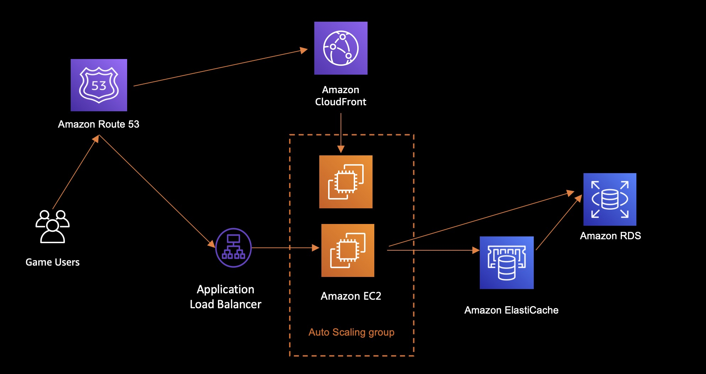
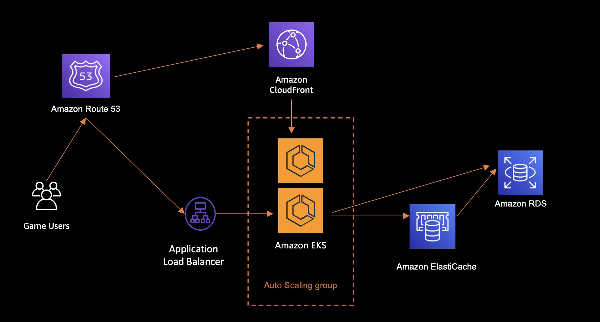

<h2 id="Game1">彩票系統</h2>

*   [應用說明](#Game11)
*   [架構目標](#Game12)
*   [架構特性](#Game13)
*   [AWS服務](#Game14)
*   [參考架構](#Game15)
* * *

<h3 id="Game11">應用說明</h3>

彩票系統

<h3 id="Game12">架構目標</h3>

- 多為 Html5 網頁表現，上游API 有時候連接不太順利
- 數據庫注單異地備援
- 官方數據源不能掉線
- 多為新創，中小規模，營運成本不能太高

<h3 id="Game13">架構特性</h3>

- 運用自動化建置技術，可以快速建立彩票系統
- 依各個彩票系統表現，提供自動擴容與自動偵測機制，確保前端系統穩定
- 多樣性資料庫系統，滿足不同客戶間遊戲建置的需求
- 運用代管型資料庫系統，可以輕鬆管理與高度擴展資料庫系統

<h3 id="Game14">AWS服務</h3>

- [Amazon EC2](https://aws.amazon.com/tw/ec2/instance-types/)
- [Amazon EBS](https://aws.amazon.com/tw/ebs/volume-types/)
- [Amazon Relational Database Service (RDS)](https://aws.amazon.com/tw/rds/)
- [Amazon ElastiCache](https://aws.amazon.com/tw/elasticache/)

<h3 id="Game15">參考架構</h3>

EC2參考架構

K8S參考架構

* * *

