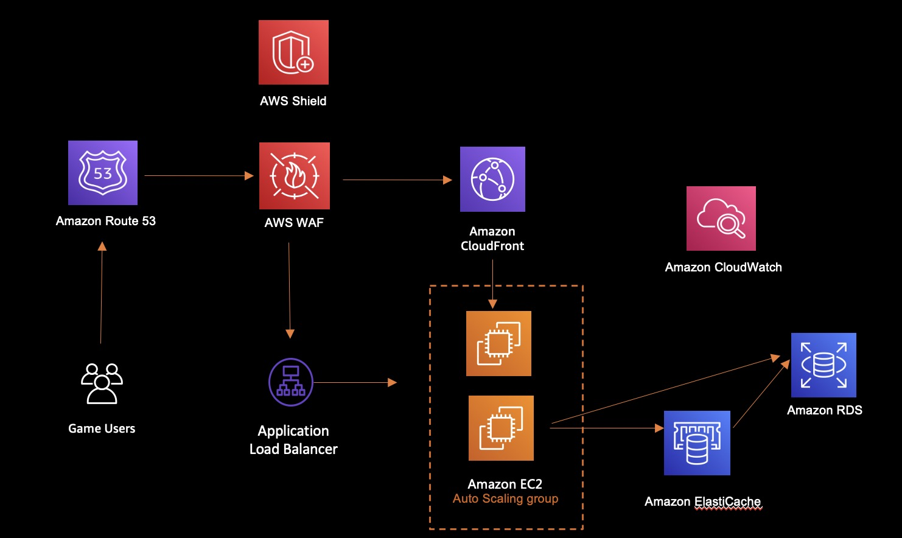

<h2 id="Game1">包網平台</h2>

*   [應用說明](#Game11)
*   [架構目標](#Game12)
*   [架構特性](#Game13)
*   [AWS服務](#Game14)
*   [參考架構](#Game15)
* * *

<h3 id="Game11">應用說明</h3>

包網平台

<h3 id="Game12">架構目標</h3>

-  遊戲種類多，活動多，服務器擴展能力要大
-  因開站需求，服務器需要能夠獨立運作
-  最容易被DDOS攻擊，前端CDN需要有防護力
-  前端需要放很多數據分析能力
-  上游API 種類多，系統架構層次多

<h3 id="Game13">架構特性</h3>

- 提供集中化營運中樞，可以從一個集中位置追蹤和解決跨 AWS 應用程式和資源的營運問題
- 建立自動化告警系統，針對系統異常事件發出通知，並結合自動化處理程序
- 運用內建系統監控機制，提供整體系統運作效能和資源優化
- 完整的CI/CD工具，可以提供各個遊戲快速上版所需
- 提供包括DDoS, WAF, network security 等多重資安防護

<h3 id="Game14">AWS服務</h3>

- [AWS Shield](https://aws.amazon.com/tw/shield/)
- [AWS WAF](https://aws.amazon.com/tw/waf/)
- [Amazon CloudFront](https://aws.amazon.com/tw/cloudfront/)
- [Amazon CloudWatch](https://aws.amazon.com/tw/cloudwatch/)
- [AWS Code family](https://aws.amazon.com/tw/blogs/devops/complete-ci-cd-with-aws-codecommit-aws-codebuild-aws-codedeploy-and-aws-codepipeline/)

<h3 id="Game15">參考架構</h3>

參考架構

* * *

